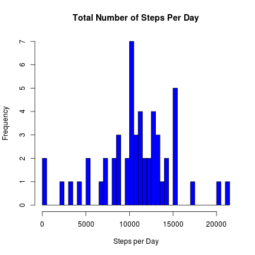
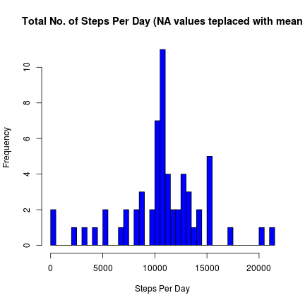
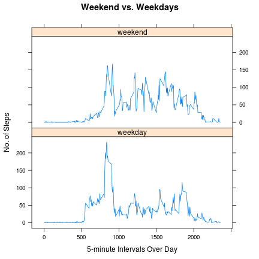

# Reproducible Research: Peer Assessment

## Loading and preprocessing the data
After downloading and unziping the following [dataset](https://d396qusza40orc.cloudfront.net/repdata%2Fdata%2Factivity.zip), we place it in our work directory and load it in R.


```r
    # read the data
    data <- read.csv("~/R_env/RepData1/activity.csv")
```

## What is mean total number of steps taken per day?


```r
    # Find the total number of steps taken each day:
    steps.day <- aggregate(steps~date, data=data, FUN=sum)
```

```r
    # Make a histogram of the total number of steps taken each day:
    hist(steps.day$steps, breaks=nrow(steps.day), main="Total Number of Steps Per Day", xlab="Steps per Day", col="blue")
```

 

```r
    # Calculate the mean and median total number of steps taken per day:
    mean_steps.day <- mean(steps.day$steps)
    median_steps.day <- median(steps.day$steps)
```
The **mean** total number of steps per day is 10766.19  
The **median** total number of steps per day is 10765

## What is the average daily activity pattern?


```r
    # Find the average number of steps taken per 5 minute interval:
    average.interval <- aggregate(steps~interval, data=data, FUN=mean)
```

```r
    # Make a time series plot of the 5-minute interval and the average number of steps taken, averaged across all days:
    plot(average.interval, type="l", main="Average Daily Activity Pattern", xlab="5-minute Intervals", ylab="Average Steps Taken (All days)")
```

 

```r
    # Find the 5-minute interval, on average across all the days in the dataset, that contains the maximum number of steps:
    max.interval <- average.interval[which.max(average.interval$steps),"interval"]
```
The 5-minute interval with the **maximum number of steps** (across all days)  
is 835

## Imputing missing values

```r
    # Calculate the total number of missing values in the dataset 
    total_na <- sum(is.na(data))
```
The total **number of missing values** in the dataset is 2304.  
  
The missing values will be **replaced with the mean** of the 5-minute interval averaged across all days.


```r
    # Create a vector of steps with NAs replaced by imputed value (mean of 5-minute interval):
    no_na.steps <- numeric()
    for(i in 1:nrow(data)) {
        obs <- data[i,]
        if (is.na(obs$steps)) {
            steps <- subset(average.interval,interval==obs$interval)$steps
        } else {
            steps <- obs$steps
        }
        no_na.steps <- c(no_na.steps,steps)
    }
    
     # Create a new dataset that is equal to the original dataset but with the missing data filled in:
    no_na.data <- data
    no_na.data$steps <- no_na.steps
    
    # Find the total number of steps taken each day:
    no_na.steps.day <- aggregate(steps~date, data=no_na.data, FUN=sum)
```

```r
    # Make a histogram of the total number of steps taken each day:
    hist(no_na.steps.day$steps, breaks=nrow(no_na.steps.day), main="Total No. of Steps Per Day (NA values teplaced with mean", xlab="Steps Per Day", col="blue")
```

 

```r
    # Calculate the mean and median total number of steps taken per day:
    mean_no_na.steps.day <- mean(no_na.steps.day$steps)
    median_no_na.steps.day <- median(no_na.steps.day$steps)
```
The **mean** total number of steps taken per day is 10766.19  
The **median** total number of steps taken per day is 10766.19

After replacing missing values with the intervals mean, the **total median has increased** from 10766.19 to 10766.19. The is **no impact on the mean**, as that was the value used for the replacement (by using the median, the outcome is different).

## Are there differences in activity patterns between weekdays and weekends?


```r
    ## Change date column from factor to Date:
    no_na.data$date <- as.Date(no_na.data$date)

    #Create a new factor variable in the dataset with two levels “weekday” and “weekend” indicating whether date is a weekday or weekend day:
    Sys.setlocale("LC_TIME", "English")
```

```
## Warning in Sys.setlocale("LC_TIME", "English"): OS reports request to set
## locale to "English" cannot be honored
```

```
## [1] ""
```

```r
    weekend.days <- c("sábado","domingo")#Spanish computer, you know... >.<
    no_na.data$daytype <- as.factor(sapply(no_na.data$date, function(x) ifelse(weekdays(x) %in% weekend.days,"weekend","weekday")))
```

```r
    # Make a panel plot containing a time series plot (i.e. type = "l") of the 5-minute interval (x-axis) and the average number of steps taken, averaged across all weekday days or weekend days (y-axis):

    require(plyr)
```

```
## Loading required package: plyr
```

```r
    mean_steps.day <- ddply(no_na.data, .(interval, daytype), summarize, steps = mean(steps))

    require(lattice)
```

```
## Loading required package: lattice
```

```r
    xyplot(steps ~ interval | daytype, data = mean_steps.day, layout = c(1, 2), type = "l", xlab="5-minute Intervals Over Day", ylab="No. of Steps", main="Weekend vs. Weekdays")
```

 


###Some conclusions from this last analysis:
 * The activity along the day seems higher during the weekend.  
 * Nevertheless, on those days activity starts later, as on weekdays people get up  
   earlier (because of work, school...).
